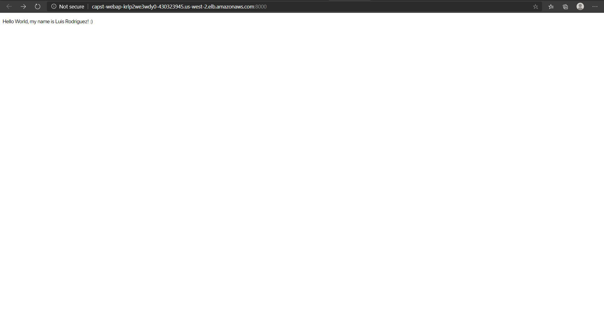

# Capstone Project

This is the capstone project for the Cloud DevOps Nanodegre Program, and contains a simple web app:

> CI/CD pipeline for a static website with cluster in AWS EKS (rolling deployment)

